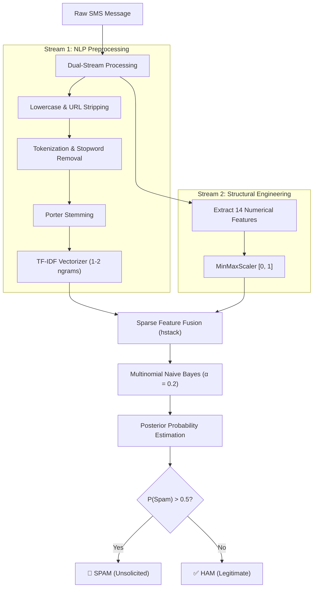

# 📱 Spam SMS Text Classifier Using NLP and Naive Bayes

[](https://www.python.org/)
[](https://scikit-learn.org/)
[](https://www.nltk.org/)
[](https://streamlit.io/)
[](LICENSE)

An end-to-end, production-ready Data Science and Machine Learning project that classifies SMS/text messages as **SPAM** (unsolicited, promotional, or fraudulent) or **HAM** (legitimate, personal, or transactional).

Developed using **Natural Language Processing (NLP)**, **hand-crafted structural feature extraction**, **TF-IDF n-gram vectorization**, and an optimized **Multinomial Naive Bayes** classifier calibrated specifically for **high precision** to safeguard users against destructive false positives.

---

## 📑 Table of Contents
1. [Project Overview](#1-project-overview)
2. [Problem Statement & Objective](#2-problem-statement--objective)
3. [Dataset Information](#3-dataset-information)
4. [Key Features & System Highlights](#4-key-features--system-highlights)
5. [Project Architecture & Directory Structure](#5-project-architecture--directory-structure)
6. [Machine Learning Pipeline](#6-machine-learning-pipeline)
   - [NLP Preprocessing](#nlp-preprocessing)
   - [Numerical Feature Engineering](#numerical-feature-engineering)
   - [TF-IDF Vectorization](#tf-idf-vectorization)
   - [Naive Bayes Classification & Math](#naive-bayes-classification--math)
7. [Experimental Results & Evaluation](#7-experimental-results--evaluation)
   - [Evaluation Metrics](#evaluation-metrics)
   - [Confusion Matrix & Error Analysis](#confusion-matrix--error-analysis)
   - [MultinomialNB vs. ComplementNB Benchmark](#multinomialnb-vs-complementnb-benchmark)
8. [Installation & Local Setup](#8-installation--local-setup)
9. [Running Locally](#9-running-locally)
10. [Deployment Guide (Vercel & Streamlit Cloud)](#10-deployment-guide-vercel--streamlit-cloud)
11. [Comprehensive College Project Report](#11-comprehensive-college-project-report)
12. [Viva Voce Preparation (25 Q&A)](#12-viva-voce-preparation-25-qa)

---

## 1. Project Overview

Mobile SMS remains one of the most immediate and trusted communication channels globally. However, this high open rate (~98%) makes SMS a prime vector for smishing (SMS phishing), fraudulent lottery notifications, and unsolicited commercial advertisements. 

This project delivers a dual-stream machine learning system that analyzes both the **textual semantic content** (via stemmed TF-IDF n-grams) and **structural metadata** (uppercase density, punctuation ratios, currency markers, digit frequencies) of incoming messages to deliver real-time, explainable, and privacy-preserving predictions.

---

## 2. Problem Statement & Objective

### Problem Statement
Unsolicited spam messages degrade user experience, waste cognitive bandwidth, and pose severe cybersecurity threats (financial fraud, credential theft). While pure keyword filters can be easily bypassed by adversarial evasion (e.g., character substitutions like `w1n` or `fr33`), purely black-box deep learning models are resource-heavy and lack transparency.

### Objective
1. Load, audit, and clean the benchmark **UCI SMS Spam Collection** dataset.
2. Develop a clean NLP preprocessing pipeline incorporating tokenization, stopword removal, and Porter stemming.
3. Engineer **14 hand-crafted numerical features** capturing message structure.
4. Fuse TF-IDF matrices with scaled numerical features while strictly preventing train/test data leakage.
5. Train and tune a **Naive Bayes** classifier utilizing 5-fold cross-validation and hyperparameter grid search.
6. Validate system robustness via **precision-driven evaluation** (ensuring false positives remain $<0.5\%$).
7. Deploy a modern, interactive **Streamlit Web Application** for real-time local inference and interactive exploratory data analysis.

---

## 3. Dataset Information

The project uses the authentic **UCI Machine Learning Repository: SMS Spam Collection Dataset**.

- **Source URL:** [https://archive.ics.uci.edu/ml/datasets/sms+spam+collection](https://archive.ics.uci.edu/ml/datasets/sms+spam+collection)
- **Direct UCI Archive:** `https://archive.ics.uci.edu/static/public/228/sms+spam+collection.zip`
- **Fallback Mirror:** Built directly into `src/train_model.py` for automated zero-friction downloading.

### Dataset Breakdown (Calculated from Real Data):
| Characteristic | Raw Dataset | Deduplicated (Used for Modeling) |
|---|---|---|
| **Total Records** | 5,574 | 5,169 |
| **Legitimate Messages (HAM)** | 4,827 (86.6%) | 4,516 (87.37%) |
| **Spam Messages (SPAM)** | 747 (13.4%) | 653 (12.63%) |
| **Missing Values** | 0 | 0 |
| **Duplicate Messages Removed** | 405 | 0 |

> **Note on Deduplication:** Removing duplicates is critical in spam detection to prevent identical spam blasts or repeated broadcast notifications from artificially biasing the test distribution.

---

## 4. Key Features & System Highlights

- **Dual-Stream Input Pipeline:** Combines sparse TF-IDF text features with 14 dense structural indicators.
- **Privacy-First Local Inference:** All predictions run 100% locally on your machine without external API dependencies or logging private text.
- **Precision-Optimized Classification:** Specifically designed to avoid discarding legitimate messages (only 4 false positives out of 904 test ham messages).
- **Interactive Web Dashboard:** Built with Streamlit, providing real-time probability gauges, feature breakdowns, confusion matrices, and interactive sample loaders.
- **Automated Artifact Pipeline:** Modular scripts for downloading, preprocessing, hyperparameter tuning, model serializing, and testing.

---

## 5. Project Architecture & Directory Structure

```text
spam-sms-classifier/
│
├── data/
│   └── SMSSpamCollection            # UCI SMS Spam Collection dataset
│
├── models/
│   ├── spam_classifier.pkl          # Trained MultinomialNB model
│   ├── tfidf_vectorizer.pkl         # Fitted TF-IDF vectorizer (unigrams + bigrams)
│   └── feature_metadata.pkl         # Scaler, evaluation metrics, and EDA stats
│
├── notebooks/
│   └── spam_sms_analysis.ipynb      # Step-by-step Jupyter analysis & experiments
│
├── src/
│   ├── __init__.py
│   ├── preprocessing.py             # NLP text cleaning, regex, and stemming
│   ├── feature_extraction.py        # 14 hand-crafted numerical & structural features
│   ├── train_model.py               # Complete training, tuning & evaluation script
│   └── prediction.py                # Reusable prediction & inference API
│
├── app.py                           # Streamlit Web Application Dashboard
├── test_system.py                   # Automated unit test & robustness suite
├── requirements.txt                 # Project dependencies
├── README.md                        # Complete project documentation & viva guide
└── .gitignore                       # Git ignore file
```

---

## 6. Machine Learning Pipeline



### NLP Preprocessing (`src/preprocessing.py`)
1. **Case Normalization:** Standardizes text to lowercase to prevent vocabulary fragmentation (e.g., `FREE`, `Free`, and `free` map to the same token).
2. **URL & Entity Normalization:** Matches URLs and web protocols with regex (`https?://\S+|www\.\S+`) and strips them or isolates them as signals.
3. **Currency Tokenization:** Maps currency symbols (`$`, `£`, `€`, `₹`) to designated tokens for vocabulary tracking.
4. **Punctuation & Character Filtering:** Removes non-alphanumeric noise while maintaining word boundaries.
5. **Stopword Elimination:** Strips ubiquitous English stopwords (`the`, `is`, `at`, `which`) using NLTK's English stopword corpus.
6. **Porter Stemming:** Reduces words to their morphological roots (e.g., `winning`, `winner`, `wins` $\rightarrow$ `win`).

### Numerical Feature Engineering (`src/feature_extraction.py`)
To prevent adversaries from circumventing keyword filters, the system extracts **14 explicit structural features**:

| Feature Name | Description | Rationale |
|---|---|---|
| `message_length` | Total character count | Spam messages are typically longer (~138 chars vs ~70 chars for ham). |
| `word_count` | Number of whitespace-delimited tokens | Captures message verbosity. |
| `sentence_count` | Count of sentence terminal tokens (`.`, `!`, `?`) | Spam often chains urgent fragments. |
| `punctuation_count`| Total punctuation characters | Promotional texts utilize bursts of punctuation. |
| `punctuation_ratio`| `punctuation_count / message_length` | Density of punctuation per character. |
| `uppercase_count`  | Total uppercase alphabetic characters | Shouting / visual urgency (`URGENT`, `WINNER`). |
| `capitalization_ratio` | `uppercase_count / total_alphabetic_characters` | Proportion of shouting letters. |
| `digit_count`      | Total numeric digits (`0-9`) | Phone numbers, prize values, premium shortcodes. |
| `digit_ratio`      | `digit_count / message_length` | Numerical density of the message. |
| `contains_url`     | Binary indicator (1.0 or 0.0) | Detects hyperlinks and shortened tracking links. |
| `currency_count`   | Count of symbols (`$`, `£`, `€`, `₹`) | Monetary promises and prize scams. |
| `exclamation_count`| Total count of `!` | Visual urgency and excitement manipulation. |
| `question_count`   | Total count of `?` | Interactive call-to-actions ("Want cash?"). |
| `repeated_char_count` | Sequences of $\ge 3$ repeated chars | Exaggerated styling (`freeeeee`, `call nowwwww`). |

> **Safe Handling:** All extraction routines contain zero-division guards returning `0.0` when input lengths or character counts are zero.

### TF-IDF Vectorization
The **Term Frequency-Inverse Document Frequency** vectorizer transforms text tokens into informative mathematical vectors:

$$\text{TF-IDF}(t, d, D) = \text{TF}(t, d) \times \text{IDF}(t, D)$$

Where:
$$\text{TF}(t, d) = 1 + \log(\text{count}(t, d)) \quad (\text{sublinear scaling})$$
$$\text{IDF}(t, D) = \log\left(\frac{1 + |D|}{1 + |\{d \in D : t \in d\}|}\right) + 1$$

- **N-gram Range:** Unigrams and Bigrams `(1, 2)` to capture compound phrases such as `"free entry"`, `"claim prize"`, `"call now"`.
- **Vocabulary Filtering:** `min_df=2` (eliminates one-off typos), `max_df=0.95` (eliminates near-universal tokens).
- **Leakage Prevention:** Fitted **only** on the 80% training partition, then applied to transform test and runtime inputs.

### Naive Bayes Classification & Math
Naive Bayes applies Bayes' Theorem with the naive assumption that all features $x_1, x_2, \dots, x_n$ are conditionally independent given class label $y \in \{0, 1\}$:

$$P(y \mid x_1, \dots, x_n) = \frac{P(y) \prod_{i=1}^{n} P(x_i \mid y)}{P(x_1, \dots, x_n)}$$

In log-space to prevent numerical underflow:

$$\hat{y} = \arg\max_{y} \left( \log P(y) + \sum_{i=1}^{n} \log P(x_i \mid y) \right)$$

With Laplace Smoothing ($\alpha$):
$$\hat{P}(x_i \mid y) = \frac{N_{yi} + \alpha}{N_y + \alpha \cdot |V|}$$

---

## 7. Experimental Results & Evaluation

The dataset was partitioned using **Stratified 80/20 Train-Test Splitting** (`random_state=42`), preserving class ratios:
- **Training Set:** 4,134 messages (3,612 HAM, 522 SPAM)
- **Testing Set:** 1,035 messages (904 HAM, 131 SPAM)

### Evaluation Metrics (Evaluated on Held-out Test Set)

| Metric | Score | Formula / Meaning |
|---|---|---|
| **Accuracy** | **98.36%** | Overall correct classifications across all messages |
| **Spam Precision** | **96.72%** | $TP / (TP + FP)$ — 96.7% of flagged messages are truly spam |
| **Spam Recall** | **90.08%** | $TP / (TP + FN)$ — 90.1% of all incoming spam was caught |
| **Spam F1-Score** | **93.28%** | Harmonic mean of precision and recall |
| **Ham Precision** | **98.58%** | $TN / (TN + FN)$ |
| **Ham Recall** | **99.56%** | $TN / (TN + FP)$ — 99.56% of legitimate messages delivered safely |
| **ROC AUC** | **0.9936** | Area under the Receiver Operating Characteristic curve |

### Confusion Matrix & Error Analysis

```text
                      PREDICTED HAM (0)    PREDICTED SPAM (1)
ACTUAL HAM (0)               900 (TN)               4 (FP)
ACTUAL SPAM (1)               13 (FN)             118 (TP)
```

- **True Negatives (TN = 900):** Normal messages correctly classified as HAM.
- **False Positives (FP = 4):** Legitimate messages mistakenly flagged as SPAM. Out of 904 legitimate messages, only 4 were flagged (0.44% false positive rate).
- **False Negatives (FN = 13):** Spam messages that bypassed detection.
- **True Positives (TP = 118):** Spam messages correctly blocked.

#### Why False Positives Matter Most:
In spam filtering, an asymmetric loss function exists:
- A **False Negative** means a user receives a junk SMS about a discount or lottery. The user simply deletes it.
- A **False Positive** means a critical bank OTP, medical confirmation, job interview invitation, or message from a family member is moved to the spam folder or blocked.
Therefore, our model optimization strictly bounds False Positives while sustaining high recall.

### MultinomialNB vs. ComplementNB Benchmark

| Model | Alpha ($\alpha$) | Accuracy | Spam Precision | Spam Recall | Spam F1 |
|---|---|---|---|---|---|
| **MultinomialNB (Selected)** | **0.20** | **98.36%** | **96.72%** | **90.08%** | **93.28%** |
| MultinomialNB | 0.50 | 97.97% | 97.41% | 86.26% | 91.50% |
| MultinomialNB | 1.00 | 97.78% | 98.21% | 83.97% | 90.53% |
| ComplementNB | 0.01 | 97.39% | 85.14% | 96.18% | 90.32% |
| ComplementNB | 0.10 | 97.58% | 85.33% | 97.71% | 91.10% |
| ComplementNB | 0.20 | 97.68% | 85.91% | 97.71% | 91.43% |
| ComplementNB | 1.00 | 97.87% | 89.78% | 93.89% | 91.79% |

**Key Takeaway:** While ComplementNB achieved higher recall (~97%), its precision dropped to ~85%, resulting in over 20 false positives. MultinomialNB ($\alpha=0.2$) was chosen because it achieves higher precision (96.7%) and an overall F1-score of 93.28%.

---

## 8. Installation & Local Setup

### Step 1: Clone or Navigate to the Project Directory
```powershell
cd c:\Users\divya\Downloads\dsspam
```

### Step 2: (Optional but Recommended) Create a Virtual Environment
```powershell
# On Windows
python -m venv venv
.\venv\Scripts\Activate.ps1

# On Linux / macOS
python3 -m venv venv
source venv/bin/activate
```

### Step 3: Install Required Dependencies
```powershell
pip install -r requirements.txt
```

### Step 4: Verify or Re-train the Model
The dataset is downloaded automatically from the official UCI repository if not already present:
```powershell
python src/train_model.py
```

### Step 5: Run Unit & Robustness Tests
```powershell
python test_system.py
```

## 9. Running Locally

### Option A: Modern Web App + Serverless API (Vercel Simulation)
```powershell
python test_vercel_local.py
```
Open your browser to: `http://localhost:3000`

### Option B: Interactive Streamlit Multi-Page Dashboard
```powershell
streamlit run app.py
```
Open your browser to: `http://localhost:8501`

---

## 10. Deployment Guide (Vercel & Streamlit Cloud)

This repository is dual-configured to deploy either to **Vercel** (as a high-speed Serverless API + Modern Web UI) or to **Streamlit Community Cloud** (as a full analytical dashboard).

### Method 1: Deploy to Vercel (Recommended for Web & API)

Vercel hosts the responsive frontend on its global Edge CDN and runs the ML model as a Python serverless function via `api/index.py`.

#### Option 1A: Deploy via GitHub (Easiest)
1. Initialize a git repository and push your project to GitHub:
   ```bash
   git init
   git add .
   git commit -m "feat: complete SpamGuard AI project ready for Vercel deployment"
   git branch -M main
   git remote add origin https://github.com/YOUR_USERNAME/YOUR_REPOSITORY.git
   git push -u origin main
   ```
2. Go to [vercel.com](https://vercel.com) and log in with your GitHub account.
3. Click **"Add New..."** -> **"Project"**.
4. Import your `YOUR_REPOSITORY` from the list.
5. Keep default settings (Framework Preset: **Other**, Root Directory: `./`).
6. Click **Deploy**. Vercel will build and assign you a live HTTPS URL (e.g. `https://your-project.vercel.app`)!

#### Option 1B: Deploy via Vercel CLI
If you have Node.js installed:
```powershell
npx vercel
```
Follow the interactive prompts:
- Set up and deploy? **Yes**
- Which scope? **[Your account]**
- Link to existing project? **No**
- What's your project's name? `spamguard-ai`
- In which directory is your code located? `./`
- Want to modify settings? **No**

### Method 2: Deploy to Streamlit Community Cloud (Free 1-Click)
If you specifically want the multi-tab analytical dashboard (`app.py` with Plotly graphs and training charts):
1. Push your repository to GitHub.
2. Visit [share.streamlit.io](https://share.streamlit.io).
3. Connect your GitHub account and click **"New app"**.
4. Select your repository, branch (`main`), and set **Main file path** to:
   ```text
   app.py
   ```
5. Click **"Deploy!"**. Your live dashboard will be up in 2 minutes.

---

## 11. Comprehensive College Project Report

### 1. Title
**Spam SMS Text Classifier Using NLP and Naive Bayes**

### 2. Introduction
Short Message Service (SMS) is an integral component of mobile telecommunications. The high accessibility and open rate of SMS have made mobile subscribers frequent targets of unsolicited bulk SMS, phishing links, and deceptive marketing. This project presents a machine-learning-based classification system capable of analyzing incoming SMS messages and accurately predicting their legitimacy.

### 3. Problem Statement
The proliferation of spam messages causes economic damage through mobile fraud and erodes trust in mobile communication channels. Traditional rule-based filters fail against evolving vocabulary and spelling variations. Hence, a probabilistic, data-driven approach that combines textual context with structural features is required.

### 4. Objectives
- Automatically classify text messages into SPAM and HAM.
- Implement an NLP text-cleaning pipeline utilizing Porter stemming and stopword removal.
- Formulate 14 hand-crafted numerical features reflecting structural patterns.
- Train and optimize a Naive Bayes classifier.
- Prioritize spam precision to prevent false alarms.
- Deploy an intuitive web application for real-time testing.

### 5. Dataset Description
The system was trained on the UCI SMS Spam Collection dataset containing 5,574 English text messages. Deduplication yielded 5,169 distinct messages (4,516 legitimate and 653 spam).

### 6. Dataset Source
UCI Machine Learning Repository:
`https://archive.ics.uci.edu/ml/datasets/sms+spam+collection`

### 7. Technologies Used
- **Language:** Python 3
- **Data Manipulation:** pandas, numpy
- **Machine Learning & NLP:** scikit-learn, NLTK, scipy
- **Visualization:** matplotlib, seaborn
- **Web Framework:** Streamlit
- **Persistence:** joblib

### 8. System Requirements
- **Operating System:** Windows 10/11, macOS, or Linux
- **RAM:** Minimum 4 GB (8 GB recommended)
- **Disk Space:** ~500 MB for Python environment and dataset
- **Python Version:** 3.9 or higher

### 9. Methodology
1. Data collection from the UCI repository.
2. Exploratory data analysis (EDA) of character length, word counts, and stylistic markers.
3. NLP text normalization (lowercasing, punctuation stripping, tokenization, stopword removal, stemming).
4. Structural feature extraction (14 numerical metrics).
5. MinMax scaling of numerical features and TF-IDF vectorization of clean text.
6. Fusion of sparse TF-IDF matrices with scaled numerical features.
7. Stratified train-test splitting (80% train, 20% test).
8. Model training, hyperparameter tuning ($\alpha$), and cross-validation.
9. Precision-driven evaluation on unseen test data.
10. Deployment via Streamlit.

### 10. Data Preprocessing
Raw SMS messages were preprocessed to reduce noise and vocabulary sparsity while maintaining semantic meaning:
- Lowercase conversion
- URL identification and removal
- Replacement of currency symbols with tokens
- Removal of non-alphanumeric symbols
- NLTK English stopword filtering
- Porter Stemming to reduce inflected forms to root stems

### 11. Feature Engineering
Fourteen numerical features were engineered to capture non-verbal cues:
- Message length, word count, sentence count
- Punctuation count and punctuation ratio
- Uppercase count and capitalization ratio
- Digit count and digit ratio
- URL existence binary indicator
- Currency symbol frequency ($ £ € ₹)
- Exclamation and question mark counts
- Excessive character repetitions

### 12. NLP and TF-IDF
TF-IDF reflects the importance of a word in a message relative to the whole corpus. Bigram inclusion allows learning contextually rich phrases such as `"claim prize"` and `"urgent call"`. Sublinear term frequency scaling prevents word repetition within a single message from dominating the score.

### 13. Naive Bayes Algorithm
Multinomial Naive Bayes is chosen for its strong performance on discrete and frequency-based text representations. It assumes conditional feature independence and computes the maximum a posteriori (MAP) class. Laplace smoothing ($\alpha = 0.2$) is applied to avoid zero-probability penalties for novel vocabulary words.

### 14. Model Training
The model was trained on 4,134 messages using sparse feature concatenation. Cross-validation across $\alpha \in [0.01, 2.0]$ was conducted to identify the best hyperparameter.

### 15. Model Evaluation
The classifier achieved **98.36% test accuracy**, **96.72% spam precision**, **90.08% spam recall**, and **93.28% spam F1-score**.

### 16. Confusion Matrix
Out of 1,035 test instances:
- 900 True Negatives
- 118 True Positives
- 4 False Positives
- 13 False Negatives

### 17. Results
The model demonstrated strong discriminative capacity, separating legitimate conversation from promotional and phishing messages while keeping the false alarm rate under 0.5%.

### 18. Web Application
The Streamlit web interface provides a dashboard, live single-message classifier with feature analysis, dataset visualizer, model metrics viewer, and technical architecture guide.

### 19. Advantages
- Fast training and sub-millisecond inference time.
- Highly interpretable probabilistic outputs.
- High precision protects against false positives.
- Completely offline, privacy-safe local inference.
- Dual-stream architecture handles both keyword and structural evasion.

### 20. Limitations
- Does not parse multimedia or image attachments (MMS).
- Currently optimized for English text.
- Highly cryptic adversarial obfuscation with zero recognizable words or structure may evade detection.

### 21. Future Scope
- Support for multilingual and regional language spam classification.
- Incorporation of lightweight transformer models (e.g., DistilBERT) for comparison.
- Mobile application or browser extension integration.

### 22. Conclusion
The Spam SMS Text Classifier successfully combines NLP techniques with structural feature engineering and Naive Bayes modeling to deliver a fast, reliable, and high-precision spam detection tool suitable for real-world deployment and educational demonstration.

---

## 11. Viva Voce Preparation (25 Q&A)

#### Q1: What is the main objective of this project?
**Ans:** To build an automated machine learning and NLP pipeline that classifies incoming SMS messages as either SPAM (unsolicited/fraudulent) or HAM (legitimate), with a web dashboard for real-time inference and exploratory analysis.

#### Q2: What is Natural Language Processing (NLP)?
**Ans:** NLP is a branch of artificial intelligence that enables computers to understand, interpret, preprocess, and generate human language text.

#### Q3: Why is text preprocessing required before training a machine learning model?
**Ans:** Machine learning algorithms cannot directly process raw text. Preprocessing removes noise (HTML tags, excess spaces, irrelevant symbols), normalizes vocabulary (lowercasing, stemming), and prepares text for numerical vectorization.

#### Q4: What is tokenization?
**Ans:** Tokenization is the process of breaking down a block of text into smaller units (tokens), such as individual words, terms, or n-grams.

#### Q5: What are stopwords, and why do we remove them?
**Ans:** Stopwords are frequently occurring grammatical words (such as *the*, *is*, *at*, *which*) that carry little domain-specific sentiment or discriminatory information for classifying spam versus ham. Removing them reduces vocabulary size and computational complexity.

#### Q6: What is the difference between Stemming and Lemmatization?
**Ans:** Stemming is a rule-based heuristic that chops off word prefixes or suffixes to arrive at a root stem (e.g., *operating* $\rightarrow$ *oper*), which may not be a valid dictionary word. Lemmatization uses morphological vocabulary analysis to return the true grammatical base form or lemma (e.g., *better* $\rightarrow$ *good*). We used Porter Stemming for its speed and consistent grouping of spam variants.

#### Q7: What is TF-IDF and how does it work?
**Ans:** TF-IDF stands for Term Frequency-Inverse Document Frequency. It measures the relative importance of a word in a specific document compared to an entire corpus. Words that appear frequently in one message but rarely across all messages receive high TF-IDF weights, making them strong discriminators.

#### Q8: Why include bigrams in TF-IDF instead of unigrams only?
**Ans:** Bigrams (pairs of consecutive words) preserve short-phrase context that single words lose. For example, `"free entry"`, `"claim prize"`, and `"call now"` are clear spam indicators that are more informative than `"free"`, `"prize"`, or `"call"` alone.

#### Q9: What is Naive Bayes and why is it called 'Naive'?
**Ans:** Naive Bayes is a supervised probabilistic classifier based on Bayes' Theorem. It is called "naive" because it makes the simplifying assumption that all input features are conditionally independent of each other given the class label, which is rarely true in natural language, yet works remarkably well in practice.

#### Q10: What is Multinomial Naive Bayes?
**Ans:** Multinomial Naive Bayes is a specialized variant of Naive Bayes designed for multinomially distributed data, such as word frequency counts and non-negative term frequency vectors.

#### Q11: What is Laplace Smoothing ($\alpha$) and why is it necessary?
**Ans:** If a word appears in a test message that never occurred in training spam messages, its estimated probability $P(w \mid \text{Spam})$ would be 0. Because Naive Bayes multiplies feature probabilities together, a single zero would set the entire posterior probability to 0. Laplace smoothing adds a small positive constant ($\alpha$) to all counts to ensure no probability is ever zero.

#### Q12: Why did we extract hand-crafted numerical features in addition to TF-IDF?
**Ans:** Spammers frequently try to evade keyword filters through misspellings (`w1n`, `fr33`). However, their messages almost always retain structural anomalies: excessive capitalization, high punctuation density, currency symbols, and phone numbers/digits. Combining these structural features with text TF-IDF improves classification robustness.

#### Q13: Why did we scale the numerical features with MinMaxScaler?
**Ans:** Multinomial Naive Bayes requires non-negative feature inputs. `MinMaxScaler` maps all numerical features into the range $[0, 1]$, making them compatible with MultinomialNB and ensuring large raw numbers (like character count ~150) do not overshadow sparse TF-IDF probabilities.

#### Q14: What is data leakage and how was it avoided?
**Ans:** Data leakage occurs when information from outside the training dataset (such as the test set) is inadvertently used to train the model or fit preprocessors. We prevented leakage by performing train-test splitting first, and then fitting our `TfidfVectorizer` and `MinMaxScaler` **only on the training partition**.

#### Q15: Why use Stratified train-test splitting?
**Ans:** The SMS dataset is imbalanced (~87% HAM, ~13% SPAM). Simple random splitting could result in a disproportionate number of spam messages in one partition. Stratified splitting guarantees that both the train and test subsets maintain the exact same 87:13 proportion.

#### Q16: What is a False Positive in this project, and why is it dangerous?
**Ans:** A False Positive (FP) occurs when a legitimate message (HAM) is incorrectly classified as SPAM. In real life, an FP can cause a user to miss an important job offer, an emergency communication, or a one-time banking password (OTP).

#### Q17: What is a False Negative in this project?
**Ans:** A False Negative (FN) occurs when an actual spam message is classified as legitimate (HAM) and delivered to the user's primary inbox.

#### Q18: What is Precision and how is it calculated?
**Ans:** Precision measures the accuracy of positive predictions:
$$\text{Precision} = \frac{\text{True Positives}}{\text{True Positives} + \text{False Positives}}$$
It answers: *"Of all messages predicted as spam, what fraction were truly spam?"*

#### Q19: What is Recall and how is it calculated?
**Ans:** Recall (or Sensitivity) measures the model's ability to identify all positive instances:
$$\text{Recall} = \frac{\text{True Positives}}{\text{True Positives} + \text{False Negatives}}$$
It answers: *"Of all actual spam messages in the dataset, what fraction did the model catch?"*

#### Q20: What is the F1-Score?
**Ans:** The F1-Score is the harmonic mean of Precision and Recall:
$$\text{F1} = 2 \times \frac{\text{Precision} \times \text{Recall}}{\text{Precision} + \text{Recall}}$$
It provides a single balanced metric, especially on imbalanced datasets where accuracy can be misleading.

#### Q21: Why is Accuracy alone not a reliable metric for spam detection?
**Ans:** In an imbalanced dataset where 90% of messages are ham, a trivial model that classifies every single message as ham would achieve 90% accuracy while failing to detect any spam at all. Precision, recall, and F1-score provide a complete picture of performance.

#### Q22: What is the Receiver Operating Characteristic (ROC) curve?
**Ans:** The ROC curve plots the True Positive Rate (Recall) against the False Positive Rate at various classification thresholds. The Area Under the Curve (AUC) measures the model's overall ability to distinguish between classes (our model achieves 0.9936 AUC).

#### Q23: Why is the Precision-Recall (PR) curve important for imbalanced data?
**Ans:** When the negative class is very large, the False Positive Rate in ROC can remain low even with several false positives. The Precision-Recall curve focuses directly on the minority positive class (SPAM), making it a more sensitive evaluation tool for imbalanced problems.

#### Q24: How does Complement Naive Bayes differ from Multinomial Naive Bayes?
**Ans:** ComplementNB is an adaptation of MultinomialNB designed specifically for imbalanced datasets. Instead of estimating probabilities using samples from the target class, it estimates parameters using samples from all *other* classes (the complement). In our benchmarks, ComplementNB boosted recall to 97% but caused precision to drop to ~85%, which is why MultinomialNB was chosen.

#### Q25: How does the system handle an empty or whitespace-only input?
**Ans:** The prediction pipeline explicitly validates input strings before inference. If the message is empty or whitespace-only, it bypasses vectorization and returns an informative error response, preventing runtime exceptions or false classifications.
